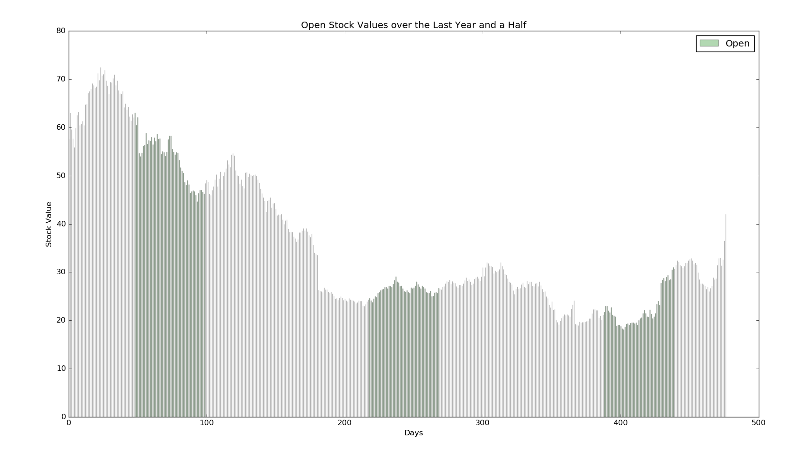
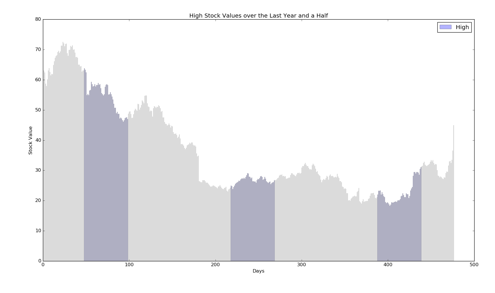
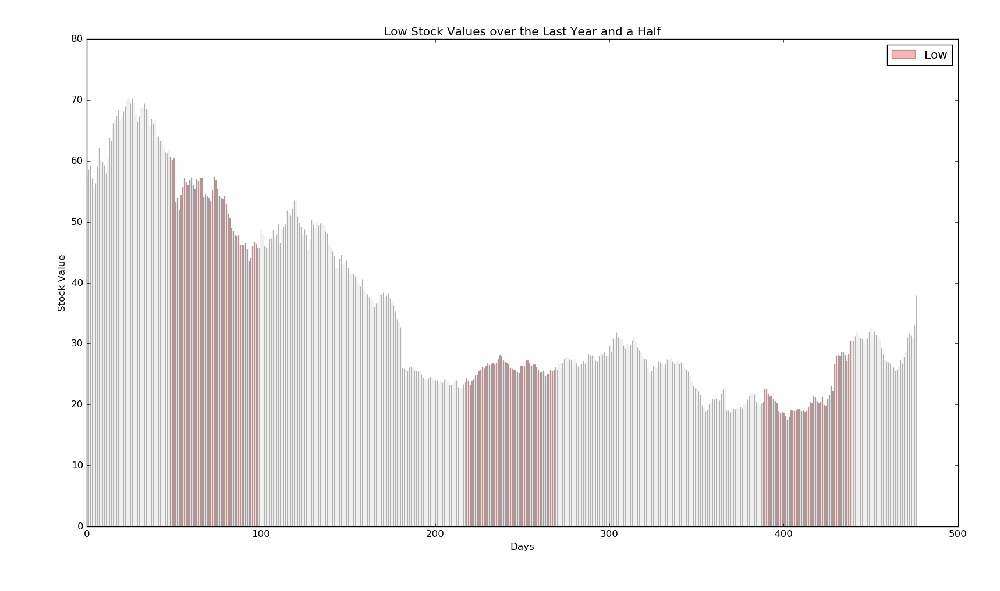
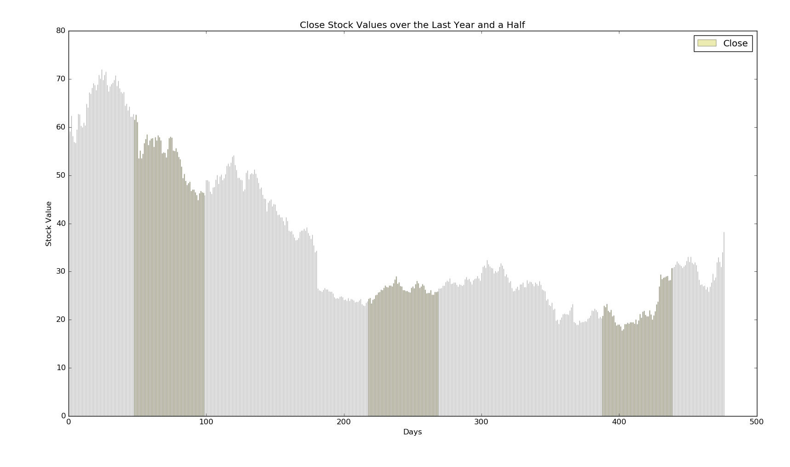
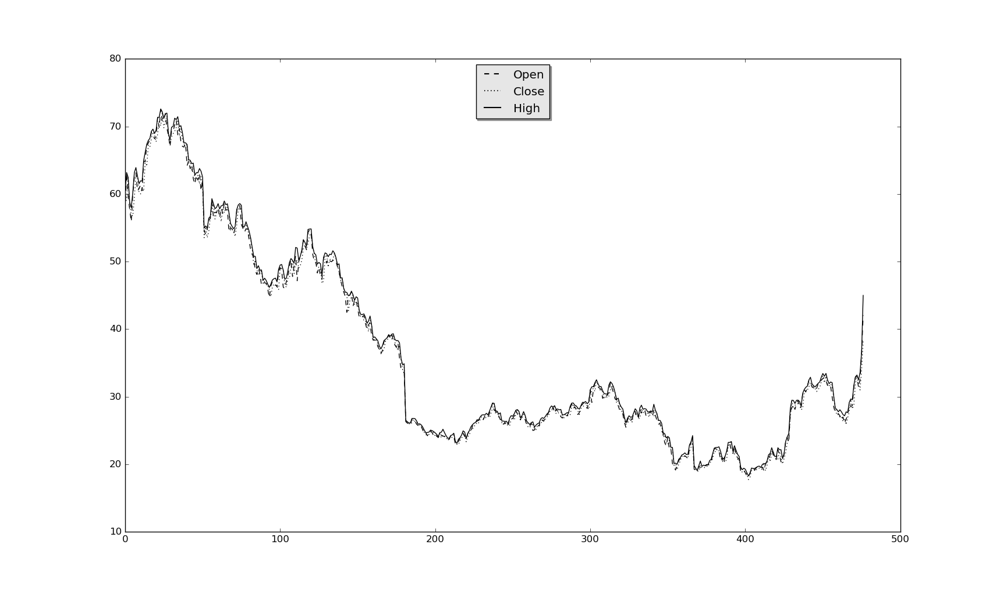
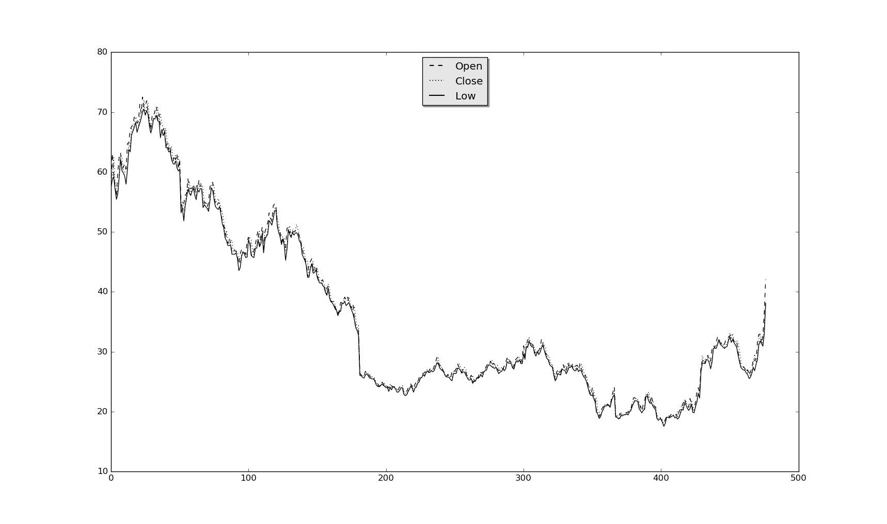

EX2: Data exploration from an API
=================================


In this exercise I've chosen to explore the change in Facebook's stock value over the last 1.5 years.
I wanted to see if it went up/down or stayed the same.
On the next step, we can find the reasons behind the numbers we've got, and see what critical events caused the changes.

I've found the data online and used python in order to generate graphs from Quandl's API.


Dependencies
------------
  1. Numpy Library
  2. Requests Library
  3. Matplotlib Library


Steps
-----
  * Use Quandl's API to get information about Facebook's stocks:
  
    ```python
    request = requests.get('https://www.quandl.com/api/v3/datasets/WIKI/FB.json?end_date=2014-04-11?api_key=w4mFn8DZ_okL3s1zM6Dm').json()
    data = request['dataset']['data']
    ```

  * Arrange the different data:

    ```python
    dates = []
    open_vals = []
    high_vals = []
    low_vals = []
    close_vals = []
    for day in data:
        dates.append(day[0])
        open_vals.append(day[1])
        high_vals.append(day[2])
        low_vals.append(day[3])
        close_vals.append(day[4])
    ```
  
  * Graph functions:
  
    ```python
    n_groups = 477
    fig, ax = plt.subplots()
    index = np.arange(n_groups)
    bar_width = 0.1
    opacity = 0.3
    error_config = {'ecolor': '0.3'}
    rects1 = plt.bar(index, data, bar_width,
                     alpha=opacity,
                     color=color,
                     error_kw=error_config,
                     label=label)
    plt.xlabel('Days')
    plt.ylabel('Stock Value')
    plt.title(title)
    plt.legend()
    plt.tight_layout()
    plt.show()
    ```
  
    ```python
    fig, ax = plt.subplots()
    ax.plot(open_vals, 'k--', label='Open')
    ax.plot(close_vals, 'k:', label='Close')
    ax.plot(data, 'k', label=label)
    legend = ax.legend(loc='upper center', shadow=True)
    frame = legend.get_frame()
    frame.set_facecolor('0.90')
    for label in legend.get_texts():
        label.set_fontsize('large')
    for label in legend.get_lines():
        label.set_linewidth(1.5)
    plt.show()
    ```
  
Results
-------










We can see that the stock value crashed about a year ago, from ~45$ to its lowest value ~20$ which is extremely low for a huge
company such as Facebook.
After this low point, it was pretty steady for about half a year (with a little growing), and after that, it had a huge jump,
and the stock value started growing until nowadays, and almost reached 75$!. 
However, we can see that in the last month it is falling a bit so I think it's not the best time to buy Facebook stocks.


As I've mentioned in the beginning, the next step will be exploring and checking what events caused the numbers we've got,
and maybe also try and predict what will happen in the future, based on the upcoming related events.